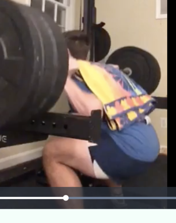
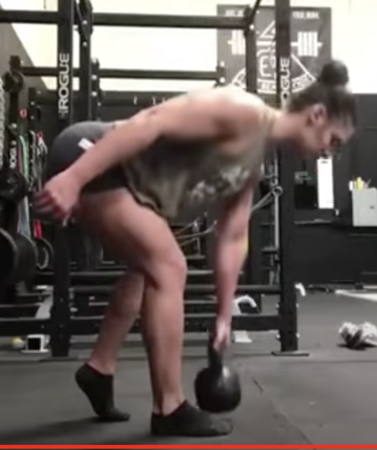

- Downward dog - extension on legs
- Quadruped taps - knees below hips
- Squat - this depth:

- Tempo goblet squat not low enough
- Front bendy over thingys

- Deadlift make sure the slack is pulled out / slow and controlled
- Squat slow and controlled
- seated pull up - hips under shoulders

## Running

- Forward body lean, heel to hamstring recovery, foot strike
- Fall forward on start to pull momentum
- hips tucked underneath you, run starts with hip, shoulder, knee in line
- Heel to butt such that it lifts the knee and then helps it drive forward on the recovery